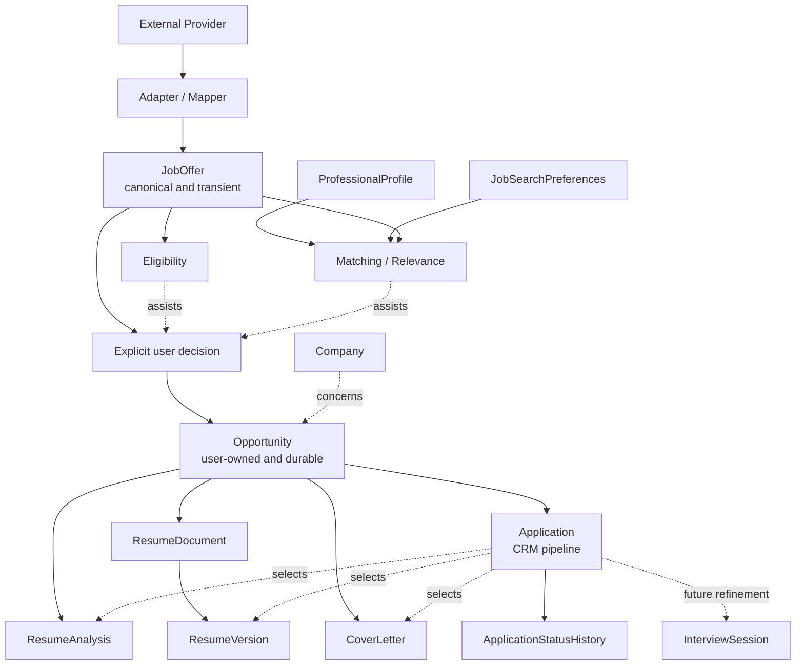

# ADR — Job Search Core Domain Model

## Statut

Accepted

## Contexte

CV Analyzer évolue progressivement vers la branche Job Search de Developer OS. Le repository contient
déjà un profil professionnel, des préférences de recherche, une découverte d'offres, un Career Workspace,
des documents de candidature, un CRM et une préparation d'entretien.

Les concepts ont cependant été introduits par étapes et leurs frontières ne sont pas encore explicites.
En particulier, `JobOffer`, `Opportunity` et `Application` sont actuellement liés par des usages voisins,
mais ne représentent pas la même réalité métier.

Cet ADR formalise le vocabulaire et les invariants suffisamment mûrs issus de ES-001 — Job Search Domain
Refinement. Il ne constitue pas un plan de refactoring et ne modifie pas l'implémentation actuelle.

## Decision

Le domaine distingue explicitement :

```text
JobOffer
    != Opportunity
    != Application
```

### JobOffer

`JobOffer` représente une offre externe canonique provenant d'un provider.

Elle est :

- owned by the provider pour ses données source ;
- produite par Job Discovery ;
- indépendante du modèle spécifique d'un provider grâce aux adapters et mappers ;
- utilisable par Eligibility et Matching ;
- transiente pour le moment.

`JobOffer` n'est pas :

- une `Opportunity` ;
- une `Application` ;
- une décision utilisateur ;
- un objet CRM.

Son identité logique est représentée par la combinaison :

```text
providerKey + providerOfferId
```

Cette identité ne donne lieu à aucune contrainte de persistence dans le cadre de cet ADR.

### Opportunity

`Opportunity` représente une cible professionnelle durable que l'utilisateur décide de considérer ou de
travailler.

Elle est :

- interne ;
- owned by the user ;
- persistante ;
- indépendante de l'existence d'une `JobOffer` ;
- le contexte principal des analyses et documents de préparation.

Une `Opportunity` peut provenir :

- d'une `JobOffer` sélectionnée ;
- d'une saisie manuelle ;
- d'une offre collée ;
- d'une URL ;
- d'une autre source future.

Une `Opportunity` peut donc exister sans `JobOffer`.

### Application

`Application` représente une démarche dans le pipeline CRM associée à une `Opportunity`.

Elle peut exister avant l'envoi effectif d'une candidature. Le statut actuel `NOT_CONTACTED` est donc un
état métier valide d'une `Application`, et ne signifie pas que la candidature a déjà été envoyée.

Une `Application` doit obligatoirement appartenir à une `Opportunity`.

Le vocabulaire ne crée pas de concepts supplémentaires tels que `Lead`, `ContactAttempt`,
`ApplicationProcess` ou `CandidateJourney` à ce stade.

### Application comme pipeline

Le pipeline actuel est interprété conceptuellement ainsi :

```text
Opportunity
    ↓
Application
    ↓
NOT_CONTACTED
    ↓
APPLIED
    ↓
WAITING
    ↓
INTERVIEW
    ↓
FOLLOWED_UP / SUCCESS / REJECTED / ARCHIVED
```

`Application` désigne donc une démarche suivie dans le pipeline CRM, et pas uniquement une candidature
déjà transmise.

### Application Preparation

Les artefacts de préparation appartiennent conceptuellement au contexte d'une `Opportunity` :

```text
Opportunity
    ├── ResumeAnalysis
    ├── ResumeDocument
    │       └── ResumeVersion
    └── CoverLetter
```

Ils peuvent exister avant toute `Application`. Le workflow suivant est donc valide :

```text
Opportunity
    → analyse
    → génération d'un CV
    → génération d'une lettre
    → décision de ne finalement pas candidater
```

Une `Application` peut ensuite sélectionner les artefacts réellement utilisés dans la démarche.

### ProfessionalProfile et JobSearchPreferences

Les deux concepts restent distincts :

```text
ProfessionalProfile
= ce que l'utilisateur possède, sait et a réalisé

JobSearchPreferences
= ce que l'utilisateur recherche
```

`ProfessionalProfile` contient notamment :

- identité professionnelle ;
- expériences ;
- compétences ;
- formations et certifications ;
- langues.

`JobSearchPreferences` contient notamment :

- rôles recherchés ;
- localisations ;
- mobilité ;
- modes de travail ;
- types de contrat ;
- technologies préférées et exclues ;
- salaire minimum.

Les préférences ne sont pas déduites automatiquement du profil. Les deux concepts peuvent être consommés
ensemble par Matching.

`ProfessionalProfile` est considéré comme un candidat potentiel à un rôle transversal de Developer OS,
mais son ownership global n'est pas décidé par cet ADR. Il reste actuellement utilisable par Job Search,
sans déplacement de package ou de module.

### Company

`Company` est un objet durable distinct.

Plusieurs `Opportunity` peuvent concerner la même `Company`. `Company` ne doit pas être réduite à une
chaîne de caractères appartenant à `Application`.

Cet ADR ne transforme pas `Company` en domaine complet de suivi d'entreprise et ne définit pas les futurs
concepts de recruteur, contact, candidature spontanée ou Company Intelligence.

### Eligibility

Eligibility répond à la question :

> Cette offre respecte-t-elle les contraintes explicites définies par l'utilisateur ?

Eligibility reste :

- déterministe ;
- explicable ;
- fondée sur des règles ;
- indépendante d'un LLM pour ses décisions.

Elle peut traiter notamment :

- type de contrat ;
- technologie exclue ;
- salaire minimum ;
- localisation ;
- mobilité ;
- données inconnues.

Une information inconnue doit pouvoir produire un état explicite tel que `REVIEW_REQUIRED`, plutôt qu'une
acceptation ou un rejet arbitraire.

### Matching / Relevance

Matching répond à la question :

> Dans quelle mesure cette offre correspond-elle au profil professionnel et aux objectifs de l'utilisateur ?

Il peut consommer :

```text
ProfessionalProfile
+ JobSearchPreferences
+ JobOffer
```

Il pourra combiner ultérieurement règles déterministes, scoring explicable, analyse sémantique et IA.
L'IA ne devient jamais la source unique d'une décision métier d'éligibilité.

Un éventuel score de Matching est un résultat dérivé. Sa persistence et son versioning feront l'objet d'une
décision ultérieure.

## Ubiquitous Language

| Terme | Définition | Ce que le terme ne désigne pas |
|---|---|---|
| `JobOffer` | Offre externe canonique retournée par un provider | Décision utilisateur, CRM, candidature |
| `Opportunity` | Cible professionnelle interne et durable travaillée par l'utilisateur | Offre provider elle-même, statut de candidature |
| `Application` | Démarche suivie dans le pipeline CRM pour une Opportunity | Offre externe, simple analyse, document |
| `ProfessionalProfile` | Capacités, expériences et identité professionnelle | Préférences de recherche |
| `JobSearchPreferences` | Intentions, contraintes et critères de recherche | Preuve que l'utilisateur possède une compétence |
| `Company` | Organisation durable pouvant concerner plusieurs Opportunities | Simple champ de candidature ou contact individuel |
| `Eligibility` | Résultat de règles explicites applicables à une JobOffer | Score global de pertinence |
| `Matching` | Estimation de correspondance entre profil, préférences et offre | Verdict d'autorisation ou décision automatique |
| `Application Preparation` | Analyses et documents préparés pour une Opportunity | Preuve qu'une candidature a été envoyée |
| `InterviewSession` | Session de préparation ou de simulation d'entretien | Concept dont le rattachement métier est définitivement décidé |

## Core Domain Model



Ce diagramme décrit le domaine, pas les classes Spring/JPA ni une architecture de déploiement.

## Business Invariants

### Invariants adoptés

- Une `Application` doit appartenir à une `Opportunity`.
- Une `Opportunity` peut exister sans `Application`.
- Une `Opportunity` peut exister sans `JobOffer`.
- Une `JobOffer` ne crée pas automatiquement une `Opportunity`.
- La conversion `JobOffer → Opportunity` est une sélection explicite et contrôlée par l'utilisateur.
- Les documents de préparation peuvent exister sans `Application`.
- Les documents sont préparés dans le contexte d'une `Opportunity`.
- Une `Application` ne peut sélectionner comme documents de candidature que des artefacts appartenant à la
  même `Opportunity`.
- Cet invariant de cohérence s'applique au minimum à `ResumeVersion`, `CoverLetter` et `ResumeAnalysis`.
- `Eligibility` reste déterministe et explicable.
- `Matching` reste distinct d'`Eligibility`.
- Un résultat IA ne devient pas automatiquement une donnée de confiance.
- Une donnée provider ne devient pas automatiquement une donnée user-owned.
- Une décision CRM importante ne doit pas être prise silencieusement par l'IA.

### Invariant documentaire détaillé

Pour une `Application` donnée, les artefacts sélectionnés doivent appartenir à l'`Opportunity` référencée
par cette `Application`.

Le cas suivant est donc invalide :

```text
Opportunity A
    └── ResumeVersion A

Opportunity B
    └── Application B ──X──> ResumeVersion A
```

Cet ADR formalise l'invariant métier uniquement. Il ne décide pas encore si sa garantie sera portée par :

- validation applicative ;
- query de vérification ;
- contrainte de persistence ;
- modèle de relation différent ;
- combinaison de plusieurs mécanismes.

La stratégie technique relève d'une Engineering Story ultérieure.

### Cardinalité non décidée

Cet ADR ne tranche pas la cardinalité entre `Opportunity` et `Application`.

Le schéma actuel autorise plusieurs `Application` pour une même `Opportunity`, mais cette possibilité
technique ne constitue pas une décision métier.

La question reste ouverte pour les cas suivants :

- nouvelle candidature ;
- nouvelle campagne ;
- nouvel interlocuteur ;
- candidature archivée ;
- nouvelle tentative ;
- candidature spontanée.

## AI and Human Validation Boundaries

L'IA peut :

- analyser ;
- proposer ;
- expliquer ;
- extraire ;
- générer des brouillons ;
- suggérer un matching ;
- générer des documents ;
- aider à préparer un entretien.

L'IA ne devient pas automatiquement propriétaire des décisions métier.

Les limites suivantes s'appliquent :

- une extraction IA de profil nécessite une validation utilisateur avant de devenir fiable ;
- une `JobOffer` découverte ne crée pas automatiquement une `Opportunity` ;
- une `Opportunity` représente une décision utilisateur de considérer ou travailler une cible ;
- une `Application` ne doit pas être créée silencieusement par l'IA ;
- un statut CRM ne doit pas être changé silencieusement par l'IA ;
- un document généré reste un brouillon ou un artefact contrôlé par l'utilisateur ;
- l'IA ne décide pas seule de l'éligibilité d'une offre ;
- l'envoi réel d'une candidature reste une action contrôlée par l'utilisateur.

Ces principes sont cohérents avec le comportement déjà documenté pour la proposition de profil assistée par
IA : l'extraction est revue avant application au profil.

## Domain Events

Les événements suivants sont des faits métier conceptuellement significatifs :

| Événement | Déclencheur | Intérêt potentiel |
|---|---|---|
| `JobOfferDiscovered` | Une recherche retourne une offre | Historique de recherche, observabilité |
| `OpportunityCreated` | Une Opportunity durable est créée | Historique, dashboard, workflows |
| `ResumePrepared` | Une analyse ou version de CV est produite | Historique de préparation |
| `CoverLetterPrepared` | Une lettre est générée ou éditée | Historique de préparation |
| `ApplicationCreated` | Une entrée CRM est créée | Pipeline, projections |
| `ApplicationSubmitted` | Une candidature est effectivement envoyée | Historique, relances, métriques |
| `ApplicationStatusChanged` | Le statut CRM évolue | Historique du pipeline |
| `InterviewScheduled` | Un entretien réel est planifié | Préparation et suivi |
| `ApplicationRejected` | Une candidature est refusée | Historique, analyse rétrospective |
| `OfferReceived` | Une issue positive est enregistrée | Fin potentielle du pipeline |

Cette liste n'introduit pas d'architecture event-driven. Elle ne décide ni messaging, ni broker, ni stockage
d'événements. Les événements pourront être utilisés ultérieurement pour l'historique, l'audit, les workflows,
l'observabilité ou des intégrations Developer OS.

## Consequences

### Positive

- Le vocabulaire distingue les données provider, les décisions utilisateur et le pipeline CRM.
- Les analyses et documents peuvent exister avant une candidature.
- Le statut `NOT_CONTACTED` reçoit une sémantique métier cohérente.
- Le CRM reste centré sur une `Opportunity` interne et non sur une offre externe brute.
- Les règles déterministes et le matching assisté par IA sont séparés.
- Le profil et les préférences restent indépendants.
- Le modèle ne force pas prématurément la persistence des offres provider.
- Les frontières restent compatibles avec le monolithe Spring Boot actuel.

### Negative

- Le modèle actuel ne garantit pas encore l'appartenance documentaire entre `Application` et `Opportunity`.
- `Opportunity` garde plusieurs chemins de création historiquement différents.
- `Application` conserve un nom pouvant être compris comme « candidature envoyée » alors qu'il représente un
  pipeline plus large.
- La cardinalité Opportunity/Application reste indéterminée.
- Le rattachement de `InterviewSession` n'est pas encore stabilisé.
- `Company` est partagée mais ses règles de modification et d'isolation restent imparfaites.

### Trade-offs

- Le choix de conserver `Application` comme entrée de pipeline évite d'ajouter immédiatement un nouveau
  concept, mais reporte une éventuelle clarification entre démarche et candidature.
- Le choix de garder `JobOffer` transient évite un cycle de persistence prématuré, mais empêche pour le moment
  un historique durable des résultats de discovery.
- Le rattachement des documents à `Opportunity` favorise la préparation avant candidature, mais nécessite un
  contrôle explicite des associations lorsqu'un artefact est sélectionné par `Application`.
- Le profil peut devenir transversal, mais son ownership global reste volontairement ouvert.

## Open Questions

- Quelle cardinalité métier doit exister entre `Opportunity` et `Application` ?
- Une même Opportunity peut-elle avoir plusieurs Applications actives ou successives ?
- Une `Application` supprimée permet-elle une nouvelle démarche sur la même Opportunity ?
- `ProfessionalProfile` deviendra-t-il un concept global de Developer OS ou restera-t-il consommé uniquement
  par Job Search ?
- Les résultats `JobOffer` pourront-ils être persistés après clarification des contraintes France Travail ?
- Une persistence éventuelle concernera-t-elle un snapshot, une référence, ou un modèle provider complet ?
- Un score de Matching devra-t-il être persisté et versionné ?
- Quelles versions du profil, des préférences, des règles et du modèle devront être conservées avec un score ?
- `InterviewSession` doit-elle être liée à `Opportunity`, `Application`, aux deux, ou rester indépendante selon
  le type de session ?
- Faut-il introduire ultérieurement un état `PREPARING` dans le pipeline CRM ?
- Une `Company` peut-elle exister sans Opportunity dans le futur produit ?
- Comment isoler les modifications d'une Company partagée entre plusieurs Opportunities ?
- Les futurs workflows de candidature spontanée nécessiteront-ils un concept distinct ?

## Out of Scope

Cet ADR ne décide pas :

- de microservices ;
- de messaging, Kafka ou RabbitMQ ;
- d'une architecture event-driven ;
- d'un frontend Angular ou d'une transformation frontend ;
- d'une API REST publique ;
- du multi-utilisateur ;
- de l'authentification ou de l'autorisation ;
- de RAG ;
- d'agents autonomes ;
- de la persistence de `JobOffer` ;
- d'une migration ou d'un changement de schéma ;
- d'une nouvelle FK ou contrainte SQL ;
- de l'implémentation de l'invariant documentaire ;
- de la cardinalité définitive Opportunity/Application ;
- du modèle définitif d'entretien ;
- du versioning du Matching ;
- de la suppression ou du déplacement de classes legacy.

Le monolithe Spring Boot actuel reste une architecture valide pour porter ces concepts.

## Future Considerations

### ProfessionalProfile

Le profil pourrait devenir un concept transversal de Developer OS. Cette évolution reste une considération
future avec une confiance MEDIUM et ne modifie pas l'ownership actuel du code.

### JobOffer persistence

Une décision future devra prendre en compte les contraintes de licence, de rétention, de synchronisation,
d'attribution et de données personnelles des providers concernés, notamment France Travail.

### Application cardinality

La cardinalité devra être décidée à partir des cas d'usage réels : nouvelle tentative, nouvelle campagne,
candidature spontanée, nouvel interlocuteur et archivage.

### Interview

Une prochaine Engineering Story devra distinguer au minimum :

- simulation générique ;
- préparation ciblée sur une Opportunity ;
- entretien réel lié à une Application.

### Company

Un futur besoin de contacts, de suivi d'entreprise ou de candidature spontanée pourra justifier un raffinage
du modèle Company, sans être anticipé dans cet ADR.

### Matching

Le matching pourra évoluer vers un résultat combinant preuves déterministes, score explicable et assistance
IA. Sa persistence, sa version et son rôle dans l'interface devront être décidés séparément.
