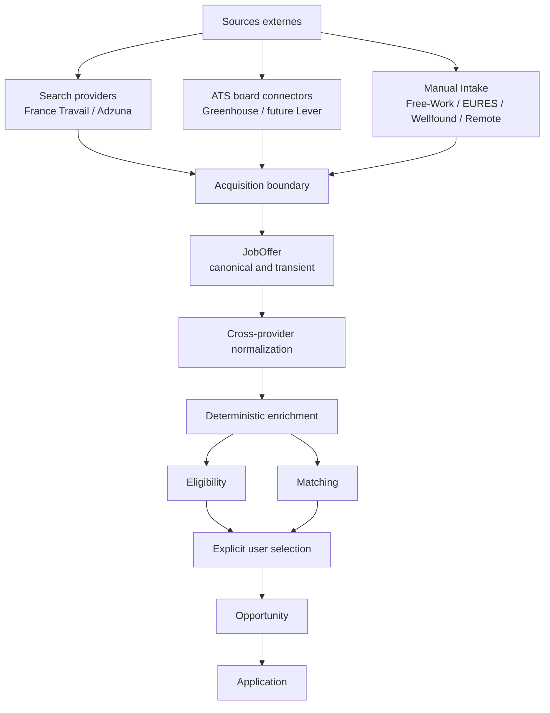

# Job Search Acquisition Architecture

Ce document détaille l'ADR `docs/adr/job-offer-acquisition-architecture.md`.

## Vue d'ensemble



## Acquisition pattern matrix

| Pattern | Input | Output | Current examples | Future boundary |
|---|---|---|---|---|
| Search provider | role/search criteria | result page of offers | France Travail, Adzuna | `JobOfferProvider` |
| ATS board connector | target board/company | company board offers | Greenhouse, future Lever | separate board capability when implemented |
| Manual intake | human-entered external offer | one `JobOffer` | all manual-only sources | existing `ManualJobOfferForm` |
| Authorized URL import | public/authorized URL | one parsed offer | not implemented | future explicit capability |
| Recruiter prospect | company/contact without vacancy | prospect record | La bonne alternance recruiter data | outside `JobOffer` |

## Boundary rules

### Acquisition adapter

Provider-specific code owns:

- authentication;
- rate/quota handling;
- request parameters;
- pagination;
- provider DTOs;
- provider error translation;
- external IDs and URLs;
- direct mappings whose meaning is explicit in the provider contract.

The adapter returns provider-neutral `JobOffer` data and preserves raw values when canonical conversion
is uncertain.

### Normalization

Normalization owns cross-provider vocabulary and comparable representations:

- contract vocabulary;
- salary period and currency;
- locations and countries;
- remote scope;
- timezone;
- seniority;
- technology aliases.

It must not silently convert unknown data into an affirmative value.

### Enrichment

Enrichment derives information that is not reliably a direct provider field:

- technology/skill extraction;
- seniority interpretation;
- remote-country interpretation;
- employment mechanism;
- startup context;
- intermediary/client classification.

Enrichment is downstream of acquisition and normalization and upstream of Eligibility/Matching. It is not
part of provider authentication or CRM creation.

## Provenance flow

```text
acquisitionSource
    = source/capability that supplied the record

originalSource
    = verified publisher, if known

externalOfferId
    = ID in a known source namespace

originalUrl
    = source listing URL, if known

applyUrl
    = application destination, if distinct
```

Example:

```text
Company -> Greenhouse -> Wellfound -> Manual Intake

acquisitionSource = MANUAL
originalSource    = UNKNOWN unless the user/provider explicitly supplies it
applyUrl          = copied application destination, if supplied
```

The path alone does not justify provenance inference.

## Deduplication flow

```text
provider result
    -> exact provider identity dedupe
    -> canonical normalization
    -> deterministic cross-source identity checks
    -> probable duplicate review
```

Safe first identities:

1. `providerKey + providerOfferId`.
2. Verified `originalSource + originalOfferId`.
3. Canonicalized original URL where URL ownership and stability are known.

Weak signals such as company/title/location can support a warning later but must not automatically merge
offers or overwrite manual intake.

## Evolution path

The first implementation story after ES-014 should validate the second search provider:

```text
France Travail
    + Adzuna
        -> later acquisition orchestration
```

Only after that should the repository introduce a board-specific ATS capability for Greenhouse. This keeps
the first architecture change grounded in two real implementations rather than a speculative registry or
framework.
